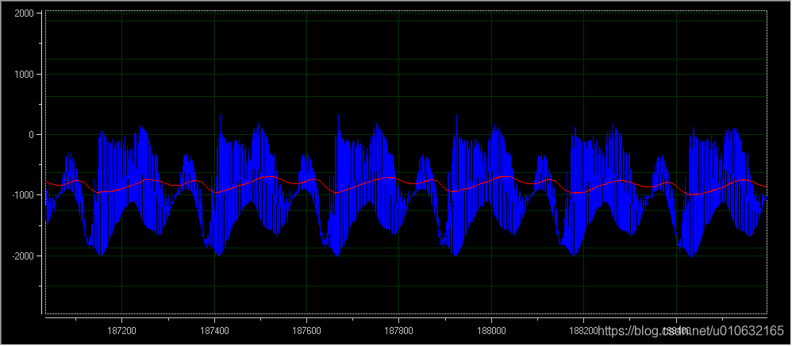

# 数据常用滤波处理

## 目录
*   [滤波出现的原因和作用](#滤波出现的原因和作用)
*   [均值滤波](#均值滤波)
*   [一阶滞后滤波以及一阶互补滤波](#一阶滞后滤波和一阶互补滤波)
*   [Mahony滤波](#mahony滤波)
*   [卡尔曼滤波](#kalman滤波)
---
参考学习资料 : 

https://blog.csdn.net/qq_46280347/article/details/120743250
https://blog.csdn.net/weixin_43152152/article/details/119819318

## 滤波出现的原因和作用
滤波,顾名思义:用于滤掉杂波.这里的杂波,指的是不太干净的数据。出现不干净的数据主要是因为传感器是没法获取到真正的外界信息，在采集外界信息时，往往会被各种东西干扰，比如振动、温度等，从而引入不干净的数据导致数据波动大。如果把不干净的数据用于PID控制器的输入，则会导致PID控制器输出也会受到很大幅度上的干扰。如下图所示,蓝色的则是传感器可能采集到的数据，而橙色线为真实数据。


## 均值滤波
把连续N个采样值看成一个队列，队列的长度固定为N，每次采样到一个新数据放入队尾，并扔掉原来队首的一次数据（先进先出原则）把队列中的N个数据进行算术平均运算，就可以获得新的滤波结果。一般用于图像卷积

|优点： 对周期性干扰有良好的抑制作用，平滑度高，适用于高频振荡的系统;
|缺点： 不易于消除干扰所引起的采样值偏差，不适用于脉冲干扰比较严重的场合;


```c
#define N 5

uint32_t dataList[N];

int sum_filter(int data)
{
    int result = 0;
    for(int i = N-1;i > 0;i--)
        dataList[i] = dataList[i-1];
    dataList[0] = data;

    for(int i = 0;i < N;++i)
        result += dataList[i];
    result /= N;

    return result;
}
```

作用图像


## 一阶滞后滤波和一阶互补滤波
模拟量输入通道中，常用一阶低通RC滤波器来削弱干扰，但是这种方法 于对低频干扰的滤波，因为时间常熟越大，R值越大，漏电流增加。惯性滤波很好的克服了上述的缺点，采用数字形式实现的低通滤波的动态滤波方法，在滤波常数要求大的场合，这种方法尤其管用。

惯性滤波法适用于波动频繁的被测量滤波，能很好地消除周期性干扰，但是也带来了相位滞后，且灵敏度不高，滞后角大小选取有关。

这里主要是选择一阶滞后进行介绍，常用的也是一阶滞后滤波。

一阶低通滤波的算法公式为：

                         Y(n)=αX(n) + (1-α)Y(n-1) 

 

  式中：α=滤波系数；X(n)=本次采样值；Y(n-1)=上次滤波输出值；Y(n)=本次滤波输出值。 

一阶低通互补滤波则是
                       
                        Y(n)=αX(n) + (1-α)(Y(n-1) + dX(n)/dt * dt) 

dX(n)/dt 是X(n)的导数(比如角度的导数就是角速度,这个角速度是可以通过传感器测量出来的),这样设计会弥补一些滞后性,比单纯的一阶低通滤波效果好


一般滤波系数α的为小于0.5以下,也就是说上一次滤波输出值占比要大
滤波效果如图,深蓝色的是杂波




C语言实现一阶低通
```c

#define aplha 0.3

float last_out = 0.0f;

float RCfilter(float data)
{
    float out = data * aplha + (1 - aplha) * last_out;
    last_out = out;
    
    return out;
}
```

C语言实现一阶互补
```c

#define aplha 0.3f
#define T 0.003f //3ms采集一次传感器

float last_out = 0.0f;

float RCfilter(float angle,float gyro)
{
    float out = angle * aplha + (1 - aplha) * (last_out + gyro * T);
    last_out = out;
    
    return out;
}
```

下面两个滤波属于较为复杂的滤波算法,其原理不在这讲述,仅包含在代码库里

## Mahony滤波


## Kalman滤波