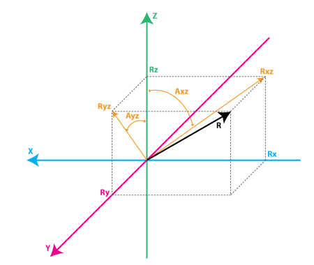

# 陀螺仪入门及处理

## 目录
*   [欧拉角](#)
*   [四元数](#)
*   [加速度计求解绝对角度](#)
*   [加速度计去重力](#)
*   [加速度计融合角速度计](#)
*   [MPU6050处理案例](#)

---
参考文献: https://zhuanlan.zhihu.com/p/45404840


### 欧拉角
比较常用的姿态定义,而且也比较直观.定义了三个轴,一个是pitch(俯仰角)轴,一个是roll(翻滚角)轴,一个是yaw(偏航角)轴.如下图所示


顾名思义, pitch 即机头向上/向下旋转了多少角度, roll 角则是机身绕 roll 轴向左/向右旋转了多少角度. yaw 角则为绕着图中的yaw axis旋转了多少角度.

### 四元数
计算中较为常用的姿态描述，但是非常不直观,计算过程比较复杂,在竞赛的大部分场景中我们无需使用,如果出现  roll 角度**接近90°**时,就需要转换成四元数进行计算了!

### 加速度计求解绝对角度
参考链接:  https://blog.csdn.net/acktomas/article/details/89087174



我们定义绕 y 轴旋转的角度为 pitch 角度,绕 x 轴旋转为 roll 角度.
如上图所示

∠Ayz 应该是 roll 角度,∠Axz 应该是 pitch 角度.一般IMU测量的**加速度AX、AY、AZ 是加速度 R 在 X、Y、Z 轴上的分解加速度**,这里的加速度 R 与重力加速度 g 方向相反,幅值相同.

故 
```c
pitch = -arctan(ax,az); //arctan 是三角函数 tan 函数的反函数,该函数在math.h头文件中
roll =   arctan(ay,az);

//使用 arctan 可避免复杂根号计算,无需计算出三角形的第三条边.

```

### 加速度计去重力
参考文献: https://zhuanlan.zhihu.com/p/195683958

IMU 测量的加速度计中含有重力加速度幅值的分量,所以采集到的加速度值不全是0.去除只需要在采集的加速度减去重力在三个轴上的分量,即可实现去重力.去重力的本质上是做一个坐标系的转换。

严谨的数学推导如下图所示:

图中的 r 是指 roll 角度,p 是指 pitch角度


不严谨的理解如下图所示,下图的坐标系表示和上图坐标系表示不太一样,但是思路差不多.


```c

g_ax = g * cos(roll) * sin(pitch);  //这里的g_a.表示的是重力幅值在三个轴上的分量,如获取真正的加速度则需要直接减去这个值
g_ay = g * sin(roll);
g_az = g * cos(roll) * cos(pitch);

```

### 加速度计融合角速度计

IMU 可以获取加速度和角速度两个值,如果单纯只是用陀螺仪积分计算角度,则会出现积分着积分着,值就不对了,这是因为测量的角速度会存在误差,积分则会把这些误差也加入角度值,这样积分出来的角度的误差会越来越大!如果单独用加速度计测量角度,加速度计对振动很敏感,会引入很多因为振动影响而造成尖刺数据,导致角度变化率很大，不能正常使用。这时候就需要将加速度计和陀螺仪数据进行融合弥补两者之间的缺陷.常用的数据融合算法有滞后互补滤波、mahony互补滤波和kalman互补滤波.

这里呢,重点讲讲简单的滞后互补滤波,因为其他两个涉及到非常复杂的数学处理,讲了也不懂  😀,但是本质上和互补滤波差不多

#### 滞后互补滤波
滞后互补滤波器和一阶滞后类似,只是加了一个补偿.使得数据滞后性减弱,噪声减少
具体做法如下
```
融合后的角度值 = 当前角度值 * aplha + (1 - aplha) * (上一次角度值 + 角速度值 * 采样周期)
```

C语言示例:
```c

#define aplha 0.3f
#define T 0.003f //3ms采集一次传感器

float last_out = 0.0f;

float RCfilter(float angle,float gyro)
{
    float out = angle * aplha + (1 - aplha) * (last_out + gyro * T);
    last_out = out;
    
    return out;
}
```

### MPU6050处理案例

```c
		MPU6050_GetData(&law_acc[0],&law_acc[1],&law_acc[2],\
			&law_gyro[0],&law_gyro[1],&law_gyro[2]);
//			
        //把因为6050寄存器是有符号16bit,其最大值应为2^16/2 就是32767,把他当成ADC采集,
        //值转换就是 采集到的值/32767.0f * 最大量程,gyro的量程一般是2000 °/dps 1000°/dps 
        //我这里是2000°,就乘2000度
        lp_filter_gyro[0] = (float)law_gyro[0] / 32767.0f * GYRO_MAX;
        lp_filter_gyro[1] = (float)law_gyro[1] / 32767.0f * GYRO_MAX;
        lp_filter_gyro[2] = (float)law_gyro[2] / 32767.0f * GYRO_MAX;
        
        //同理,加速度计的量程是按g、2g、4g、16g,所以要乘G...
        lp_filter_acc[0] = (float)law_acc[0] * ACC_MAX * G / 32767.0f ;
        lp_filter_acc[1] = (float)law_acc[1] * ACC_MAX * G / 32767.0f;
        lp_filter_acc[2] = (float)law_acc[2] * ACC_MAX * G / 32767.0f ;
		
        //对加速度计做一阶滞后
		lp_filter_acc[0] = lp_filter_acc[0] * lpfX + (1.00f - lpfX) * last_lp_filter_acc[0];
		lp_filter_acc[1] = lp_filter_acc[1] * lpfX + (1.00f - lpfX) * last_lp_filter_acc[1];
		lp_filter_acc[2] = lp_filter_acc[2] * lpfX + (1.00f - lpfX) * last_lp_filter_acc[2];
		
        //对要融合的陀螺仪数据做一阶滞后
		lp_filter_gyro[1] = lp_filter_gyro[1] * 0.35f + (1.00f - 0.35f) * last_gyro;
		last_gyro = lp_filter_gyro[1];
		
		last_lp_filter_acc[0] = lp_filter_acc[0];
		last_lp_filter_acc[1] = lp_filter_acc[1];
		last_lp_filter_acc[2] = lp_filter_acc[2];
		
		eular.acc_x = lp_filter_acc[0];
		eular.acc_y = lp_filter_acc[1];
		eular.acc_z = lp_filter_acc[2];
		
		eular.gyro_x = lp_filter_gyro[0];
		eular.gyro_y = lp_filter_gyro[1];
		eular.gyro_z = lp_filter_gyro[2];
		
		pitch = atan2f(-lp_filter_acc[0],lp_filter_acc[2]);
		eular.pitch = pitch * lpfAngle + (1.00f - lpfAngle) * (last_pitch + ANGLE_TO_RAD(eular.gyro_y) * DETLA_MS);
		last_pitch = eular.pitch;
		

```