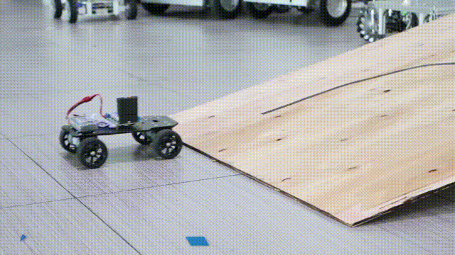

# 🚗 PID 控制

# 章节目录
* [PID 的原理](./pid-de-yuan-li.md)

---
## PID 控制是什么
先来说说闭环控制和开环控制是什么东西。

1. **闭环控制**：根据偏差去控制，跟随偏差控制，跟随着误差去控制一个执行器

2. **开环控制**：不将控制的结果反馈回来影响当前控制的系统。

拿加热丝煮开水例子来讲：

开环控制的思路：当温度高了，我就关加热器，使其降温。当温度低了，我就开加热器。

闭环控制的思路：计算出当前温度和目标温度的偏差，将这个误差代入特定的公式中计算出一个值，这个值作为加热器的功率去输出，当温度偏差大时，我们的加热器功率就高，加热就快。当温度低时，功率就低，加热效果就慢。

从思路上看，显然闭环控制的效果是优于开环控制效果的。开环控制会导致目标温度和实际温度偏差较大，且浪费很多的电能。闭环控制则是根据还差多少温度给多少功率给加热器，理论效果上，闭环控制的效果而且功率损耗是远比开环控制好的！

那么这个 **误差代入特定的公式计算出一个值** 其实就是所谓的控制算法。而 PID 控制算法则是使用的最多、最简单的控制算法啦。关于 PID 更详细的资料会在 PID 的原理章节中讲述。
> 这个图片中讲述的就是 PID 控温的效果图 

## 为什么要用到 PID 控制
PID 控制主要用于 **闭环控制** 。我们要去控制一个控制一个电机、控制小车循迹、控制加热器闭环控制水温，如果需要达到一个比较稳健的效果。则需要用到 PID 去控制。

比如说电机 **开环控制** (例如直接给一个 PWM )，当我们用手去阻挡电机旋转时，很轻易就能把电机阻挡到停止旋转造成堵转

或者说开环循迹黑线,我们常用的就是左边电平大于右边电平,则说明黑线在左边，直接无脑左转，则会发现无论弯过大或者过小，转弯转的角度都不合意，最终会出现震荡的效果。

所以说，要达到不错的控制效果，则需要使用 PID 控制算法。如下一个动态图，则是使用了 PID 的效果。

> 这是利用PID控制，闭环了车速，才能使其上车板

