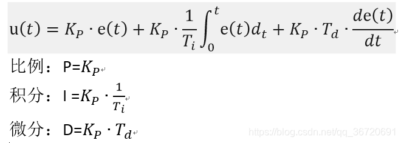
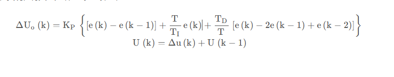

# PID 的原理

# 节目录
* [PID 参数的三个作用](#pid-参数的三个作用)
* [PID 参数调节](#pid-参数调节)
* [PID的公式推导](#PID的公式推导)
* [PID的优化使用](#PID的优化使用)

---

参考教程:

bilibili : https://www.bilibili.com/video/BV1y24y197nK/?spm_id_from=333.788.recommend_more_video.-1&vd_source=b410214c153e98023417710b229d3f43

zhihu : https://zhuanlan.zhihu.com/p/168751613


## PID 参数的三个作用
PID 的全称是比例-积分-微分控制。三个字母代表分别代表三个参数。

* P参数: 可以加快系统的响应速度,P参数过大会导致出现超调现象,甚至系统响应发散.超调的现象就是响应过度,比如说向左60度，反应过程中超过60度再回到60度.发散的现象为震荡程度逐渐严重。
* I参数: 可以减少系统的稳态误差,实现一个精确控制,但是会降低系统的响应速度,I参数过大时也会出现超调现象.
* D参数: 可以增快系统的响应速度同时抑制P参数的超调量,D太大了同样会出现超调现象.

## PID 参数调节
* 一般来说是先调P到有较小的超调量,然后等待系统稳定后增加I参数实现一个减少稳态误差的作用,最后引入D参数实现抑制超调量。

## PID的公式推导

在计算机中呢,u(t)就是输出值,单片机简单应用中就是PWM的占空比,像复杂的通信网络控制执行器中(如RM3508 RM6020等机器人关节电机,这几个电机则是用CAN通信，达妙本末执行电机的则是RS485通信),往往传输的是特定电流值、特定电压等.

e(t) 则是误差值,其中 e(t) = target - current_status;

积分e(t)dt: 就是对e(t)进行积分,具体用程序表达就是对之前误差值进求和.通过对误差的积分,并利用I参数放大误差积分,使得执行器能够继续工作到目标状态,比如5%的占空比对电机不起作用,10%的占空比对电机起到作用，但是此时的误差值不足以让PID控制器输出到10%的占空比，通过引入积分作用，使得PID控制器输出增大到10%的占空比，使得电机慢慢往设定值靠拢.从而达到目标值后，结束积分。

de(t)/dt : 就是对e(t)进行微分，具体用程序表达就是 current_e - last_e ,当前误差值减去上一次误差值。通过微分可以预测系统的响应方向,从而达到促进系统到达目标状态、抑制系统的超调现象。

```c
float error_sum = 0.0f;
float last_error = 0.0f;
float pid(float target,float ref)
{
    float kp = 0.0f,ki = 0.0f,kd = 0.0f;        //手动调pid参数
    float error = 0.0f;
    float out = 0.0f;

    error = target - ref;
    out = kp * error + ki * error_sum + kd * (error - last_error);

    error_sum += error;
    last_error = error;

    return out;

}
```
上述只是位置式PID,还有增量式PID,此时增量式的PID输出为u(t)的增量


增量式的PID中 P相当于位置式的I，I相当于位置时的P，故调参时应该优先调I参数、再调P参数。

```c
float error_sum = 0.0f;
float last_error = 0.0f;
float detal_pid(float target,float ref)
{
    float kp = 0.0f,ki = 0.0f,kd = 0.0f;        //手动调pid参数
    float error = 0.0f;
    float out_detal = 0.0f;

    error = target - ref;
    out_detal = kp * (error - last_error) + ki * error;     //增量式PID一般不使用微分

    last_error = error;

    return out_detal;
}
```


## PID的优化使用
PID使用时会出现的问题:

* 在想要实现高精度控制时,往往会使用I参数启用积分作用,若初始状态和目标值之间误差过大，会导致积分值非常大，然后导致系统超调严重，这个现象叫积分饱和现象，用于解决方法的学名则叫积分抗饱和。以下提供几种抗积分饱和的方法。

    1.  积分限幅: 就是对积分值sum_e进行限制幅度不超过最大值
    2.  积分分离: 当误差小于一定值的时候再开始积分  if(error < ...) ki = ... else ki = 0;
    3.  使用增量式PID，增量式PID不需要考虑积分饱和问题...原理可具体上网查

* 微分先行：用于处理目标值频繁变化、并且不希望有超调量，跟踪性能较好.具体资料可上网自查


C语言代码PID库，可自己移植入自己的项目中
```c
typedef struct
{
    uint8_t mode;
    //PID 三参数
    fp32 Kp;
    fp32 Ki;
    fp32 Kd;

    fp32 max_out;  //最大输出
    fp32 max_iout; //最大积分输出

    fp32 set;
    fp32 fdb;

    fp32 out;
    fp32 Pout;
    fp32 Iout;
    fp32 Dout;
    fp32 Dbuf[3];  //微分项 0最新 1上一次 2上上次
    fp32 error[3]; //误差项 0最新 1上一次 2上上次

} pid_type_def;

#define LimitMax(input, max)   \
    {                          \
        if (input > max)       \
        {                      \
            input = max;       \
        }                      \
        else if (input < -max) \
        {                      \
            input = -max;      \
        }                      \
    }

/**
  * @brief          pid struct data init
  * @param[out]     pid: PID struct data point
  * @param[in]      mode: PID_POSITION: normal pid
  *                 PID_DELTA: delta pid
  * @param[in]      PID: 0: kp, 1: ki, 2:kd
  * @param[in]      max_out: pid max out
  * @param[in]      max_iout: pid max iout
  * @retval         none
  */
/**
  * @brief          pid struct data init
  * @param[out]     pid: PID结构数据指针
  * @param[in]      mode: PID_POSITION:普通PID
  *                 PID_DELTA: 差分PID
  * @param[in]      PID: 0: kp, 1: ki, 2:kd
  * @param[in]      max_out: pid最大输出
  * @param[in]      max_iout: pid最大积分输出
  * @retval         none
  */
void PID_init(pid_type_def *pid, uint8_t mode, const fp32 PID[3], fp32 max_out, fp32 max_iout)
{
    if (pid == NULL || PID == NULL)
    {
        return;
    }
    pid->mode = mode;
    pid->Kp = PID[0];
    pid->Ki = PID[1];
    pid->Kd = PID[2];
    pid->max_out = max_out;
    pid->max_iout = max_iout;
    pid->Dbuf[0] = pid->Dbuf[1] = pid->Dbuf[2] = 0.0f;
    pid->error[0] = pid->error[1] = pid->error[2] = pid->Pout = pid->Iout = pid->Dout = pid->out = 0.0f;
}

/**
  * @brief          pid calculate 
  * @param[out]     pid: PID struct data point
  * @param[in]      ref: feedback data 
  * @param[in]      set: set point
  * @retval         pid out
  */
/**
  * @brief          pid计算
  * @param[out]     pid: PID结构数据指针
  * @param[in]      ref: 反馈数据
  * @param[in]      set: 设定值
  * @retval         pid输出
  */
fp32 PID_calc(pid_type_def *pid, fp32 ref, fp32 set)
{
    if (pid == NULL)
    {
        return 0.0f;
    }

    pid->error[2] = pid->error[1];
    pid->error[1] = pid->error[0];
    pid->set = set;                         
    pid->fdb = ref;
    pid->error[0] = set - ref;
    if (pid->mode == PID_POSITION)
    {
        pid->Pout = pid->Kp * pid->error[0];
        pid->Iout += pid->Ki * pid->error[0];
        pid->Dbuf[2] = pid->Dbuf[1];
        pid->Dbuf[1] = pid->Dbuf[0];
        pid->Dbuf[0] = (pid->error[0] - pid->error[1]);
        pid->Dout = pid->Kd * pid->Dbuf[0];
        LimitMax(pid->Iout, pid->max_iout);
        pid->out = pid->Pout + pid->Iout + pid->Dout;
        LimitMax(pid->out, pid->max_out);
    }
    else if (pid->mode == PID_DELTA)
    {
        pid->Pout = pid->Kp * (pid->error[0] - pid->error[1]);
        pid->Iout = pid->Ki * pid->error[0];
        pid->Dbuf[2] = pid->Dbuf[1];
        pid->Dbuf[1] = pid->Dbuf[0];
        pid->Dbuf[0] = (pid->error[0] - 2.0f * pid->error[1] + pid->error[2]);
        pid->Dout = pid->Kd * pid->Dbuf[0];
        pid->out += pid->Pout + pid->Iout + pid->Dout;
        LimitMax(pid->out, pid->max_out);
    }
    return pid->out;
}

/**
  * @brief          pid out clear
  * @param[out]     pid: PID struct data point
  * @retval         none
  */
/**
  * @brief          pid 输出清除
  * @param[out]     pid: PID结构数据指针
  * @retval         none
  */
void PID_clear(pid_type_def *pid)
{
    if (pid == NULL)
    {
        return;
    }

    pid->error[0] = pid->error[1] = pid->error[2] = 0.0f;
    pid->Dbuf[0] = pid->Dbuf[1] = pid->Dbuf[2] = 0.0f;
    pid->out = pid->Pout = pid->Iout = pid->Dout = 0.0f;
    pid->fdb = pid->set = 0.0f;
}


```